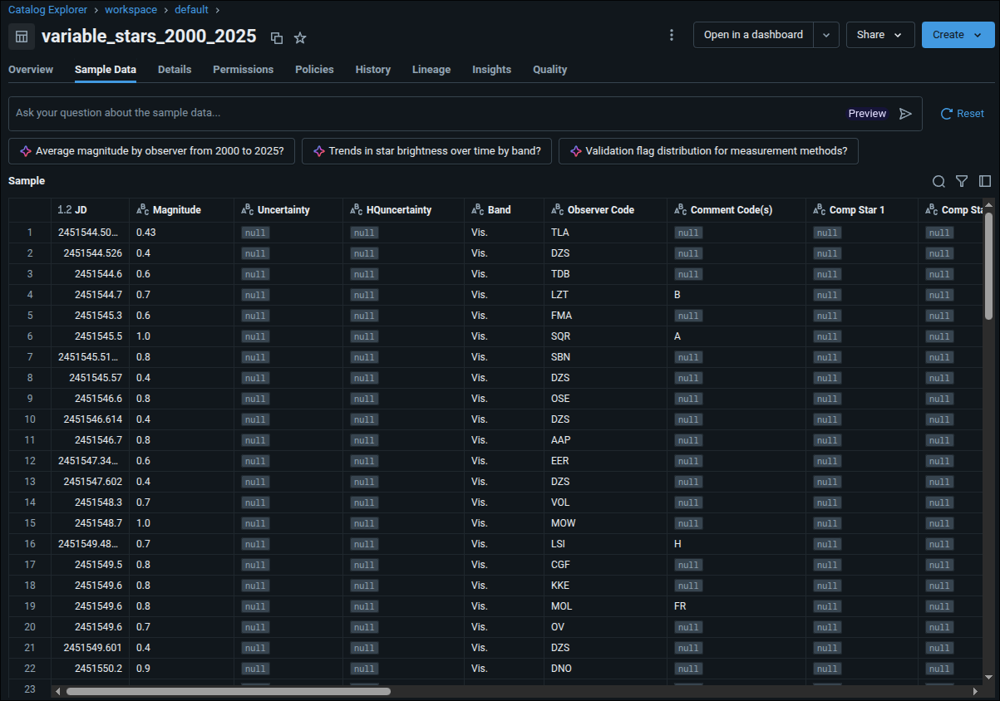
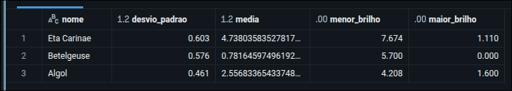
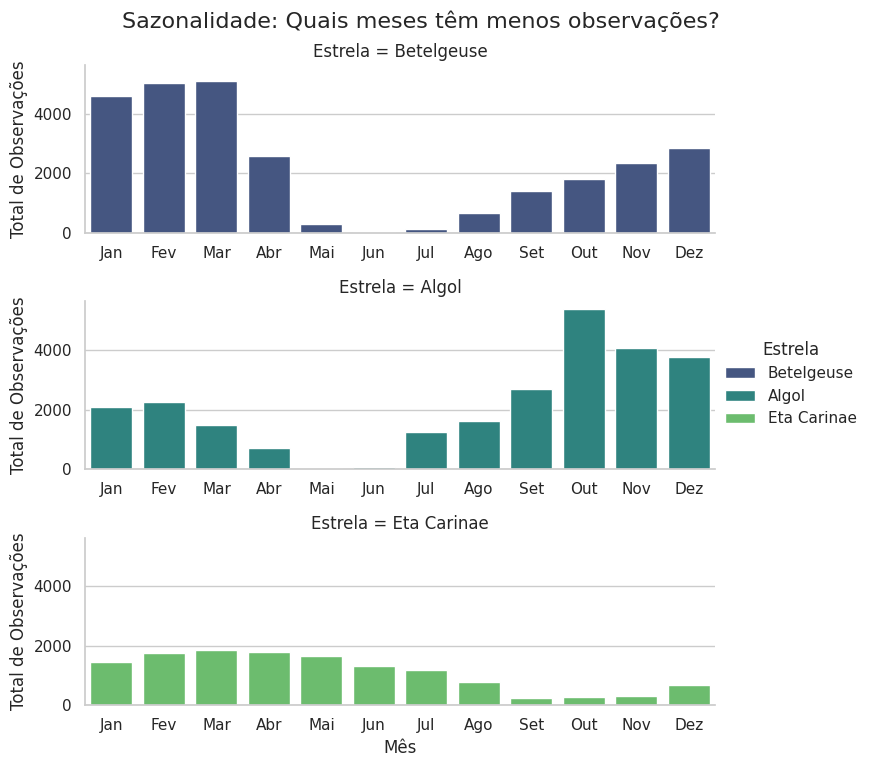
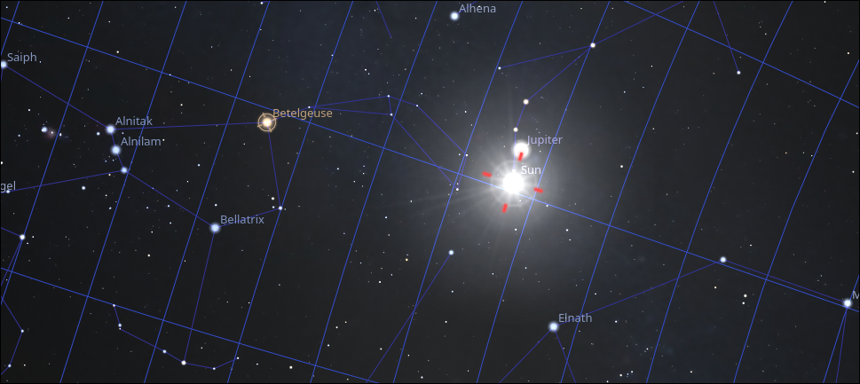
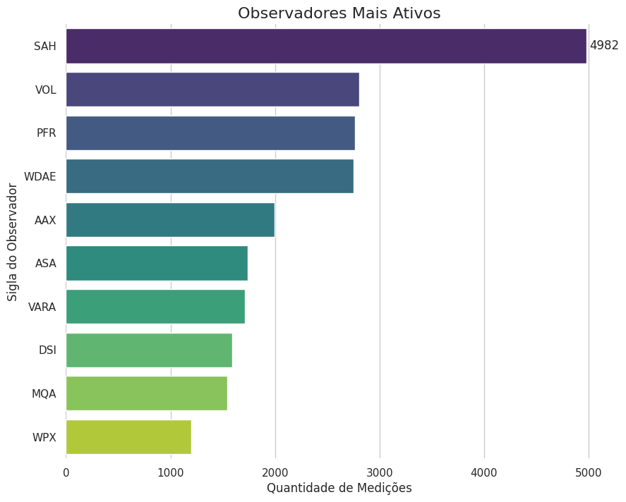

## Objetivo
A AAVSO disponibiliza um grande volume de dados de estrelas variáveis coletados por astrônomos amadores
e profissionais. Este projeto tem como objetivo realizar uma coleta, modelagem, transformação, limpeza
e análise de dados de três estrelas variáveis distintas, utilizando um modelo dimensional estrela.
#### Betelgeuse
Localizada na constelação de Órion é bem próxima ao equador celeste. Em determinadas épocas fica bem
próxima ao sol.
#### Eta carinae
Estrela supergigante azul localizada na constelação de Carina, conhecida por suas erupções massivas.
Fica próxima ao polo sul celeste.
#### Algol
Localizada na constelação de Perseu, é um sistema estelar binário eclipsante, onde uma estrela passa
na frente da outra, causando variações periódicas no brilho observado. Fica no hemisfério norte celeste.
 
> As estrelas foram escolhidas por serem bastante conhecidas e por estarem localizadas em diferentes
regiões do céu, o que pode influenciar na coleta dos dados.

### Perguntas de pesquisa
- Quais são os padrões de variação de brilho dessas estrelas ao longo do tempo?
- Qual a influência do sol nas observações estelares?
- Qual a distribuição das observações ao longo do ano?
- Que agências/astrônomos contribuem mais para os dados dessas estrelas?

## Modelagem
O modelo proposto foi um modelo dimensional estrela onde o fato é a __magnitude observada__ 
e as dimensões são:
- Data
- Estrela
- Observador
- Incerteza

## Catálogo
| Coluna | Tipo de dado | Descrição | Valores esperados |
|-------------|---------------------|--------------------------------------------------------------------|--------------------------------|
|Magnitude    |Decimal              | Brilho de um objeto no céu. Quanto menor o número, maior o brilho  | de -10.0 até +10.0             |
|Data         |Data                 | Data da observação da estrela. Formato AAAA-MM-DD                  | 2000-01-01 2021-01-01          |
|Estrela      |Texto                | Nome da estrela observada.                                         | Betelgeuse, Eta Carinae, Algol |
|Observador   |Texto                | Código do observador que fez a medição.                            | Código alfanumérico            |
|Incerteza    |Decimal              | Margem de erro associada à medição da magnitude.                   | de 0.0 até 1.0                 |

### Linhagem
- Coleta manual dos dados em formato csv na AAVSO
- Armazenamento dos dados via upload no Databricks
- Armazenamento dos dados brutos na camada bronze do Data Lake
- Limpeza e transformação dos dados na camada prata
- Transformação dos dados para o modelo dimensional na camada ouro

## Pipeline de dados
### Coleta
A coleta foi feita manualmente através de arquivos csv disponibilizados pela AAVSO.
Foi feito um upload para o Databricks e armazenado na camada bronze do Data Lake. Como o Databricks
dá a opção de criar a tabela no momento do upload, não foi necessário usar nenhum mecanismo mais
sofisticado de ingestão de dados. Foram criadas 3 tabelas, uma para cada estrela, pois assim na
camada prata ficará mais fácil fazer a limpeza dos dados.

> Nota-se muitas colunas com valores nulos, inclusive valores incorretos para o nome das estrelas.

### Limpeza
A limpeza dos dados foi feita na camada prata do Data Lake. 
- Foram removidas colunas desnecessárias
- Foram corrigidos valores incorretos para os nomes das estrelas
- Todas as linhas cujo o valor da magnitude fosse nulo foram removidas
- Todos os registros de incerteza com valores incorretos foram limpos
- A granularidade da incerteza foi padronizada pra uma casa decimal
- As datas foram convertidas para o calendário gregoriano

- [Link para o notebook da camada prata](https://github.com/igorcavalcante/MVP_engenharia_de_dados/blob/main/silver_layer.py)

### Transformação
Na golden layer fizemos o preenchimento dos dados das tabelas dimensionais e a criação da tabela fato.
A dimensão incerteza foi criada com os valores de 0.0 a 1.0 e um registro extra de valor -1.0
para representar valores nulos.

- [Link para o notebook da camada ouro](https://github.com/igorcavalcante/MVP_engenharia_de_dados/blob/main/golden_layer.ipynb)

## Análise
A análise foi feita utilizando um notebook com as bibliotecas pandas, numpy e seaborn.
O foco foi em responder as perguntas de pesquisa propostas no início do projeto.

- [Link para o notebook análise](https://github.com/igorcavalcante/MVP_engenharia_de_dados/blob/main/analise.ipynb)

### Qualidade dos dados
- Foi necessário fazer uma padronização dos nomes das estrelas na camada prata.
- Os registros de incerteza não preenchidos foram marcados com valor -1.0 na dimensão de incerteza.
- As linhas que não apresentavam valor de magnitude foram removidas.

### Solução do problema
1. Quais são os padrões de variação de brilho dessas estrelas ao longo do tempo?

> Obs. Quanto menor a magnitude, maior é o brilho da estrela.

De acordo com os valores apresentados acima é possível observar que o brilho médio de Betelgeuse
é o maior dentre as 3 estrelas.
O desvio padrão de Eta Carinae é o maior, indicando que essa estrela apresenta maior variação de brilho ao longo do tempo.
A estrela que apresentou o maior pico de brilho foi Betelgeuse.
A estrela que teve o menor brilho registrado foi Eta Carinae.

> Vale ressaltar que Betelgeuse é uma estrela supergigante vermelha que eventualmente explodirá
em uma supernova, o que pode explicar muito suas variações de brilho.

2. Qual a influência do sol nas observações estelares?

Percebe-se que durante certos meses. Destacando Betelgeuse no mês de Junho, há uma queda significativa
de observações. Analisando mais a fundo chega-se a conclusão que isso ocorre devido à proximidade
da estrela com o sol nessa época do ano, dificultando as observações.

> Fonte: stellarium

3. Qual a distribuição das observações ao longo do ano?
Pela resposta da pergunta anterior já é possível observar a distribuição das observações ao longo do ano.
Percebe-se que Betelgeuse e Eta Carinae tem uma queda significativa de observações no meio do ano,
enquanto Algol tem uma queda mais tênue ao final do ano, mas como ela está próxima ao polo norte celeste,
ela é visível durante todo o ano em latitudes mais altas.

4. Que agências/astrônomos contribuem mais para os dados dessas estrelas?
Foi registrado um total de 1062 observadores e os top 10 observadores são:

## Autoavaliação
Usar o modelo dimensional juntamente com uma pipeline de dados em camadas facilitou bastante o processo
de análise dos dados. Houve uma certa dificuldade na inicial no uso do Databricks, mas
com o assistente o assistente dele juntamente com ampla documentação viabilizaram o processo.

Para próximos passos:
- Automatizar a coleta dos dados via API da AAVSO
- Adicionar mais estrelas variáveis na análise
- Fazer análises preditivas dos brilhos das estrelas usando machine learning

## Referências
- [Stellarium](https://stellarium.org)
- [AAVSO](https://www.aavso.org)
> "We acknowledge with thanks the variable star observations from the AAVSO International 
Database contributed by observers worldwide and used in this research."
